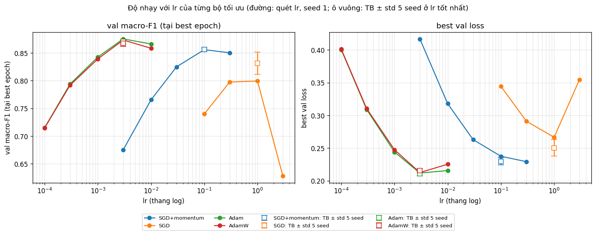
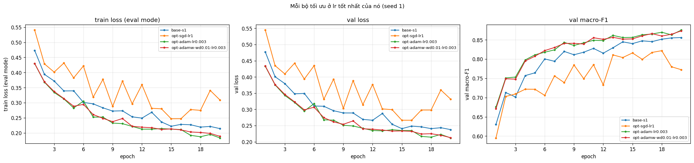
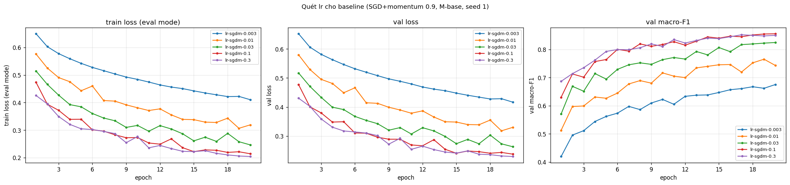
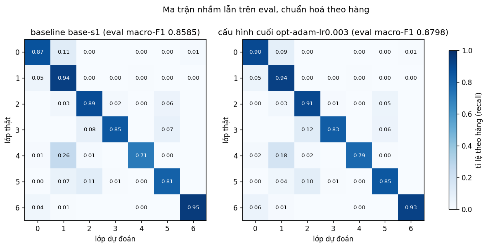

# Báo cáo Lab Day 1 — Dinh Lenh Tien Anh — 2A202602928

## 1. Thiết lập

- **Môi trường:** macOS, Apple M4, chạy trên **CPU** (PyTorch 2.8.0, 4 luồng). Không có CUDA, nên cột `peak_mem_MB` để trống. MPS không được dùng vì đo được chậm hơn CPU khoảng 4 lần với mạng nhỏ này (≈ 1,5 s so với 0,4 s mỗi epoch).
- **Dữ liệu:** Forest CoverType; `train` 464 809 / `eval` 116 203 theo `split_metadata.csv`. Validation là 20% của train (phân tầng, seed 42), còn lại 371 847 train / 92 962 val. 10 cột số được chuẩn hoá bằng mean/std của phần train còn lại; 44 cột one-hot giữ nguyên.
- **Model:** `M-base` (54→256→128→7, 47 879 tham số, ReLU, khởi tạo He, bias = 0).
- **Baseline:** CE, SGD+momentum 0,9, **lr 0,1** (chọn bằng val, mục 3.2), batch 512, 20 epoch, dropout 0, không clip, FP32.
- **Mốc tham chiếu:** "luôn đoán lớp 1" trên val cho accuracy **0,4876**, macro-F1 0,0936.
- **Các chủ đề đã thử:** ☐ loss ☑ **optimizer** (chủ đề chính) ☑ hyper-parameter (chỉ lr của baseline) ☐ dropout ☐ clipping ☐ mixed precision ☐ init
- **Vì sao tập trung vào optimizer:** chẩn đoán baseline cho thấy train loss ≈ val loss (khoảng cách 0,022) và `best_epoch` = 19–20 ở cả 5 seed, tức mô hình *chưa hội tụ trong 20 epoch* chứ không quá khớp hay mất ổn định. Theo bảng triệu chứng, dropout, clipping, AMP và init đều chữa những vấn đề baseline không có. Bộ tối ưu (cùng lr của nó) tác động thẳng vào nút thắt này.

## 2. Kiểm tra ban đầu và độ nhiễu

| Kiểm tra | Kết quả |
|---|---|
| Số tham số / shape logits | 47 879 (có `assert`) / (B, 7), không có softmax trong model |
| Loss bước 0 (so với ln 7 = 1,946) | **2,2691** (seed 1); 1,90–2,31 qua 5 seed. Thu nhỏ W lớp ra ×0,01 cho 1,944–1,948 ở cả 5 seed: độ lệch đến từ thang khởi tạo He của lớp ra (logits có std ≈ 0,55), không phải lỗi code |
| Quá khớp 20 mẫu: loss cuối | 1,7·10⁻⁴ sau 500 bước, accuracy 100% |
| Mọi tham số có gradient khác 0 | ☑ có (W1…b3: ‖g‖ từ 0,34 đến 2,02) |
| Baseline, số seed đã chạy | 5 (`base-s1`…`base-s5`) |
| Baseline: val acc (TB ± σ) | 0,9085 ± 0,0021 |
| Baseline: val macro-F1 (TB ± σ) | 0,8560 ± 0,0030 |

**Ngưỡng nhiễu dùng trong báo cáo:** 2σ = **0,0059** (val macro-F1; σ mẫu của 5 seed baseline, khớp sheet `Seeds`). Với 5 seed, σ vẫn chỉ là ước lượng thô.

## 3. Kết quả theo chủ đề

### 3.1 Bộ tối ưu hoá

**Thiết kế:** chỉ đổi bộ tối ưu và lr của nó; mọi thứ khác (model, init, loss, batch, 20 epoch, phép tách val) giữ như baseline.
- **Bước 1:** quét lr với seed 1, chọn lr tốt nhất của từng bộ theo val macro-F1.
- **Bước 2:** chạy lr tốt nhất của mỗi bộ với 5 seed, rồi so **ở lr tốt nhất của mỗi bộ**.
- **Luật chọn cấu hình cuối (đặt trước khi chạy):** val macro-F1 trung bình 5 seed cao nhất; nộp mô hình seed 1.

**Dự đoán (viết trước khi chạy, xem notebook):**
- lr tốt nhất của SGD ≈ 10 lần của SGD+momentum, và ở lr đó SGD ≈ SGD+momentum.
- Adam (lr 1e-3–3e-3) hội tụ nhanh hơn và vượt baseline quá 2σ, khoảng +0,01 đến +0,03, nhờ chuẩn hoá bước theo từng tham số (có lợi cho các cột one-hot hiếm).
- AdamW (wd 0,01) ≈ Adam, vì mô hình đang thiếu khớp; AdamW với wd = 0 trùng hệt Adam.

**Quét lr** (val macro-F1 tại best epoch, seed 1; mỗi ô là một dòng trong bảng):

| lr | 1e-4 | 3e-4 | 1e-3 | 3e-3 | 1e-2 | 0,03 | 0,1 | 0,3 | 1 | 3 |
|---|---|---|---|---|---|---|---|---|---|---|
| SGD (`opt-sgd-lr*`) | | | | | | | 0,7398 | 0,7975 | **0,7994** | 0,6280 |
| SGD+momentum (`lr-sgdm-*`) | | | | 0,6754 | 0,7656 | 0,8249 | **0,8560** | 0,8503 | | |
| Adam (`opt-adam-lr*`) | 0,7153 | 0,7939 | 0,8427 | **0,8753** | 0,8662 | | | | | |
| AdamW wd 0,01 (`opt-adamw-wd0.01-lr*`) | 0,7148 | 0,7918 | 0,8393 | **0,8733** | 0,8585 | | | | | |

**So ở lr tốt nhất của mỗi bộ, 5 seed** (seed 1 là lần quét; seed 2–5 là các dòng `<exp_id>-s2…s5`):

| Bộ tối ưu | exp_id (seed 1) | lr* | val macro-F1 TB ± σ | TB seed 2–5 | val acc TB | best epoch | s/epoch | Δ so với baseline | > 2σ? |
|---|---|---|---|---|---|---|---|---|---|
| SGD+momentum | `base-s1` | 0,1 | 0,8560 ± 0,0030 | 0,8561 | 0,9085 | 19–20 | 0,34 | — | — |
| SGD | `opt-sgd-lr1` | 1 | 0,8315 ± 0,0203 | 0,8395 | 0,8996 | 16–20 | 0,33 | −0,0245 | Có |
| **Adam** | `opt-adam-lr0.003` | 3e-3 | **0,8705 ± 0,0046** | 0,8693 | 0,9161 | 19–20 | 0,40 | **+0,0145** | **Có** |
| AdamW (wd 0,01) | `opt-adamw-wd0.01-lr0.003` | 3e-3 | 0,8673 ± 0,0056 | 0,8658 | 0,9136 | 18–20 | 0,41 | +0,0112 | Có |

**Giải thích cơ chế:**
- **Adam > SGD+momentum (+0,0145, vượt 2σ, đúng dự đoán).**
  - Adam hội tụ nhanh hơn: val loss ở epoch 1/5/10/20 là 0,433/0,295/0,249/0,212, so với baseline 0,477/0,349/0,289/0,238. Adam đạt mức val loss cuối của baseline ngay ở epoch 12.
  - Adam chia bước cho √v̂ của từng tham số, nên trọng số của các cột one-hot hiếm (gradient nhỏ, thưa) được cập nhật tương đối mạnh hơn. Bằng chứng gián tiếp trên **val** (notebook, mục 3.5): F1 của lớp lớn nhất (lớp 1) chỉ tăng +0,005, trong khi các lớp nhỏ tăng +0,015 đến +0,032.
  - Tôi không đo trực tiếp độ lớn cập nhật theo nhóm trọng số, nên đây là giải thích có căn cứ, chưa phải điều đã chứng minh.
- **SGD < SGD+momentum (−0,0245, vượt 2σ; SAI dự đoán).**
  - Đặt η_SGD = η/(1−μ) chỉ cân bằng bước đi **trung bình**. Nếu nhiễu gradient của lô có phương sai σ² và độc lập giữa các bước, cập nhật của SGD có phương sai 100η²σ², còn momentum chỉ có η²σ²/(1−μ²) ≈ 5,3η²σ². Momentum là bộ lọc thông thấp.
  - Số đo khớp với cơ chế này. Ở lr = 1, val loss của SGD tăng trở lại ở 5–10/19 epoch (SGD+momentum: 3–6), F1 giữa các epoch dao động với std 0,014–0,029 (SGD+momentum: 0,011–0,013), và σ giữa các seed là 0,020, gấp khoảng 7 lần baseline.
  - Ở lr = 3, SGD có gai ‖g‖ = 227 ngay epoch 1 (`opt-sgd-lr3`).
- **AdamW ≈ Adam (Δ = −0,0032 < 2σ, đúng dự đoán).**
  - Ở cả 5 lr, AdamW đều thấp hơn Adam một chút, và train loss cuối của AdamW cao hơn Adam ở cả 5 seed (0,194 so với 0,186). Weight decay là chính quy hoá, nên với mô hình đang thiếu khớp nó chỉ làm giảm nhẹ khả năng khớp.
  - AdamW với wd = 0 (`opt-adamw-wd0-lr0.003`) cho |Δ val_loss| = 0 tuyệt đối so với Adam: hai bộ chỉ khác nhau ở cách áp dụng weight decay.
- **Độ nhạy lr:**
  - lr tốt nhất của các họ bộ tối ưu cách nhau 1,5–2,5 bậc độ lớn (3e-3 / 0,1 / 1). Trong khoảng ~10 lần quanh lr tốt nhất, Adam và SGD+momentum vẫn giữ macro-F1 ≥ 0,82; khoảng tốt của SGD hẹp hơn.
  - Chi phí: Adam chậm hơn khoảng 20% mỗi epoch (0,40 so với 0,34 s), vì phải giữ thêm hai trạng thái m, v cho mỗi tham số.
- **Độ nhiễu:**
  - Mọi kết luận "hơn/kém" ở trên đều dựa trên trung bình 5 seed và so với 2σ = 0,0059. Adam và AdamW **không phân biệt được**.
  - Thứ hạng giữ nguyên khi chỉ dùng seed 2–5 (ước lượng không thiên lệch, vì seed 1 đã được dùng để chọn lr).

### 3.2 Hyper-parameter: lr của baseline

- **Yếu tố đã đổi:** chỉ lr của SGD+momentum (0,003 → 0,3, cách nhau khoảng 3 lần), seed 1. Cùng batch và cùng 20 epoch nên **cùng số bước cập nhật** (727 bước/epoch, 14 540 bước tổng); thời gian mỗi epoch gần như không đổi (≈ 0,34 s).
- **Kết quả:**
  - lr 0,003 và 0,01 chưa hội tụ: val loss 0,417 và 0,318, vẫn giảm đều.
  - lr 0,1 cho val macro-F1 cao nhất (0,8560); lr 0,3 cho val loss thấp nhất (0,2294) nhưng macro-F1 0,8503.
  - Chênh lệch giữa 0,1 và 0,3 là 0,0057 < 2σ, nên **không phân biệt được**. Tôi chọn 0,1 theo tiêu chí đã đặt trước (val macro-F1 cao nhất).
- **Khác dự đoán:** lr 0,3 (bước hiệu dụng η/(1−μ) = 3) không phân kỳ.

## 4. Đánh giá cuối trên tập eval

Số liệu lấy từ `eval_result.json` (cấu hình cuối) và `baseline_eval/eval_result.json` (baseline), cả hai do `scripts/evaluate.py` tạo. Mỗi mô hình được đánh giá đúng một lần, bằng trọng số của epoch có val loss thấp nhất.

| Cấu hình | Seed nộp | val macro-F1 | **eval macro-F1** | eval accuracy |
|---|---|---|---|---|
| Baseline (`base-s1`) | 1 | 0,8560 | **0,8585** | 0,9046 |
| Cấu hình cuối cùng (`opt-adam-lr0.003`) | 1 | 0,8753 | **0,8798** | 0,9156 |

- **Cấu hình cuối cùng:** baseline, chỉ đổi bộ tối ưu sang **Adam, lr = 3e-3** (β = (0,9; 0,999), ε = 1e-8). Cấu hình này được chọn hoàn toàn bằng val theo luật đặt trước ở mục 3.1. Không có thay đổi nào sau khi xem eval.
- **Cải thiện trên eval:** +0,0213 macro-F1 (+0,0109 accuracy), lớn hơn 2σ = 0,0059. Đây là hai mô hình đơn lẻ: trên val, mức cải thiện trung bình 5 seed là +0,0145, và seed 1 của Adam nằm trên trung bình khoảng 0,005. Vì vậy cải thiện "kỳ vọng" vào khoảng +0,015. Tôi không chạy eval cho các seed khác nên không có σ của điểm eval.
- **Val và eval rất gần nhau:** eval − val = +0,0025 (baseline) và +0,0044 (cuối cùng). Val là ước lượng đáng tin của eval.

### 4.1 Phân tích lỗi theo lớp (cấu hình cuối, eval)

| Lớp | support | precision | recall | F1 | F1 baseline |
|---|---|---|---|---|---|
| 0 Spruce/Fir | 42 368 | 0,9193 | 0,9008 | 0,9099 | 0,8969 |
| 1 Lodgepole Pine | 56 661 | 0,9193 | 0,9361 | 0,9276 | 0,9206 |
| 2 Ponderosa Pine | 7 151 | 0,9192 | 0,9057 | 0,9124 | 0,9040 |
| 3 Cottonwood/Willow | 549 | 0,8300 | 0,8270 | 0,8285 | 0,7993 |
| 4 Aspen | 1 899 | 0,8170 | 0,7852 | **0,8008** | 0,7629 |
| 5 Douglas-fir | 3 473 | 0,8406 | 0,8485 | 0,8445 | 0,8196 |
| 6 Krummholz | 4 102 | 0,9383 | 0,9308 | 0,9345 | 0,9061 |

- **Lớp khó nhất: lớp 4 (Aspen), F1 = 0,8008.** Lớp này hay bị nhầm với **lớp 1 (Lodgepole Pine)**: 17,6% mẫu Aspen bị đoán thành lớp 1, và lớp 1 cũng là lớp bị đoán nhầm thành Aspen nhiều nhất.
- **Lý giải bằng dữ liệu (phần train):**
  - **Mất cân bằng khoảng 30:1:** lớp 1 có 181 312 mẫu, lớp 4 chỉ có 6 075.
  - **Đặc trưng chồng lấn:** độ cao của Aspen là 2788 ± 96 m, nằm trong dải của Lodgepole (2921 ± 186 m); 90,9% mẫu Aspen rơi vào khoảng p10–p90 của lớp 1. Cả hai lớp chủ yếu thuộc vùng hoang dã 0 và 2.
  - Ở vùng chồng lấn đó, cross-entropy (trung bình theo mẫu) khiến biên quyết định nghiêng về lớp đông.
- **Cùng kiểu lỗi ở các lớp khó khác:** lớp 3 bị nhầm sang lớp 2 (11,7%) và lớp 5 bị nhầm sang lớp 2 (10,1%). Ba lớp 2, 3, 5 đều ở độ cao thấp (~2200–2400 m) và thuộc vùng hoang dã 2/3; phân bố vùng của lớp 5 gần như trùng lớp 2.
- **So với baseline,** Adam cải thiện F1 ở cả 7 lớp, nhiều nhất ở các lớp nhỏ (lớp 4 +0,038, lớp 3 +0,029, lớp 6 +0,028) so với lớp 1 (+0,007). Tỉ lệ nhầm 4→1 giảm từ 26% xuống 18%.
- **Cách cải thiện sẽ thử:** trọng số lớp trong cross-entropy (tỉ lệ nghịch với tần suất) hoặc lấy mẫu cân bằng.

## 5. Trả lời các câu hỏi dẫn dắt

**Câu 1. Bộ tối ưu nào "thắng" khi mỗi cái được chỉnh lr công bằng? Khi lr không được chỉnh thì kết luận thay đổi ra sao?**

- Khi mỗi bộ được chỉnh lr, **Adam (3e-3) và AdamW (3e-3) thắng**, và hai bộ này không phân biệt được với nhau (Δ 0,0032 < 2σ). Tiếp theo là SGD+momentum (0,1), cuối cùng là SGD (1).
- Nếu không chỉnh lr, kết luận có thể bị phóng đại hoặc sai:
  - Ở lr = 0,1, SGD thua SGD+momentum 0,116, gần 5 lần mức chênh thật ở lr tốt nhất (0,025).
  - Ở lr = 3e-3 (lr tốt nhất của Adam), SGD+momentum chỉ đạt 0,675, nên "Adam hơn SGD+momentum" sẽ thành +0,200 thay vì +0,015.
  - Ở lr = 1e-2, AdamW kém Adam 0,0077 (> 2σ), dễ dẫn đến kết luận "weight decay có hại" mà ở lr tốt nhất không còn đúng.

**Câu 2–5** (dropout, clipping, mixed precision, khởi tạo): không trả lời, vì các chủ đề này chưa được thử.

**Câu 6. Ba phép kiểm tra đầu tiên khi loss không giảm sau 2 000 bước** (≈ 2,75 epoch ở đây):

1. **Loss bước 0 có ≈ ln C không, và loss có thật sự đứng yên không?** Phép thử này rẻ, và nó tách "không học gì" (loss kẹt ở ≈ ln 7: lr quá nhỏ, nhãn sai, gradient không chảy) khỏi "khởi tạo/chuẩn hoá lệch thang" (loss bước 0 cao hơn ln 7 nhiều). Ở lab này, loss bước 0 là 2,27 chứ không phải 1,946. Phép thử thu nhỏ lớp ra cho thấy nguyên nhân là thang khởi tạo, không phải lỗi.
2. **Quá khớp một lô nhỏ (20 mẫu, tắt mọi chính quy hoá):** nếu loss không về gần 0 thì gần như chắc chắn là lỗi ở **vòng lặp/code** (nhãn lệch, softmax hai lần, quên `zero_grad`, tham số không nằm trong optimizer), không phải do dữ liệu hay năng lực mô hình. Ở đây loss về 1,7·10⁻⁴ nên pipeline đúng.
3. **In `grad_norm` theo từng lớp, rồi quét lr (3–10 lần mỗi nấc) cho đúng bộ tối ưu đang dùng:** gradient khác 0 ở mọi tham số loại trừ khả năng "gradient không chảy" (lỗi kiến trúc hoặc nơ-ron chết). Sau đó, số đo của tôi cho thấy chỉ riêng lr và bộ tối ưu đã quyết định loss giảm nhanh hay "trông như đứng yên". Sau 3 epoch, val loss là 0,58 với SGD+momentum lr 0,003, nhưng 0,38 với lr 0,1 và 0,34 với Adam 3e-3. SGD không momentum còn dao động mạnh (gai ‖g‖ tới 227 ở lr 3).

Thứ tự này đi từ rẻ đến đắt, và trả lời đúng câu hỏi của bài: phép thử 1 và 2 loại trừ **dữ liệu** và **vòng lặp**, phép thử 3 kiểm tra **kiến trúc** (gradient chảy) rồi đến **tối ưu hoá** (lr/bộ tối ưu). Trong lab này, nút thắt nằm ở tối ưu hoá.

## 6. Hạn chế và điều bất ngờ

- **Khác dự đoán:**
  - SGD ở lr tốt nhất kém SGD+momentum rõ rệt (giải thích ở mục 3.1: momentum lọc nhiễu của lô).
  - SGD+momentum lr 0,3 và Adam lr 1e-2 không dao động như tôi dự đoán.
  - Loss bước 0 lệch ln 7 tới +0,32 dù code đúng.
- **Có thể làm sai kết luận:**
  - **σ chỉ từ 5 seed:** ước lượng thô.
  - **lr chọn bằng seed 1:** với SGD, seed 1 lại là seed tệ nhất (0,7994, so với trung bình seed 2–5 là 0,8395), nên lr tốt nhất của SGD có thể chưa đúng.
  - **Lưới lr thô** (mỗi nấc ~3 lần); chưa chỉnh β, ε của Adam.
  - **Chỉ 20 epoch, mọi cấu hình đều chưa hội tụ:** kết luận là "bộ nào đi xa hơn trong 14 540 bước", không phải chất lượng tiệm cận.
  - **Eval chỉ cho một seed** của mỗi cấu hình.
  - **Chạy trên CPU:** thời gian không đại diện cho GPU; không đo được bộ nhớ.
  - **Bằng chứng theo lớp** cho cơ chế của Adam là gián tiếp và chỉ từ một seed.
- **Nếu có thêm thời gian:**
  - huấn luyện lâu hơn kèm lịch giảm lr (cosine);
  - trọng số lớp;
  - `M-wide`;
  - thí nghiệm clipping ở SGD lr 3, nơi đã thấy gai ‖g‖ = 227;
  - đánh giá eval cho nhiều seed của cấu hình cuối.

## 7. Phụ lục

- **File nộp:**
  - `REPORT.md`;
  - `experiments.xlsx`: 37 dòng (5 baseline, 5 `hparam`, 27 `optimizer`); sheet Seeds là `base-s1..s5`; sheet Summary có nhận xét;
  - `predictions_eval.csv` và `eval_result.json` (cấu hình cuối, seed 1);
  - `figures/`: 37 ảnh `<exp_id>.png`, cùng `compare_lr_sgdm.png`, `compare_baseline_seeds.png`, `compare_optimizer.png`, `compare_optimizer_lr.png`, `eval_confusion.png`;
  - `results/`: 37 file `<exp_id>.json`;
  - `code/`: `lab.ipynb`, `data.py`, `model.py`, `optimizer.py`, `train.py`, `plots.py`, `results_table.py`;
  - `baseline_eval/`: dự đoán và kết quả eval của baseline, chỉ để tham khảo.
- **Thời gian chạy:** toàn bộ notebook (Restart & Run All, 37 lần huấn luyện × 20 epoch) mất khoảng 6 phút trên CPU. Kết quả tất định trên CPU: hai lần chạy cho số giống hệt.
